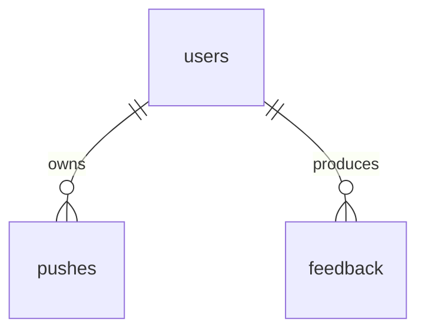

# 文献情报 Agent · 数据模型设计

> **文档版本**：v0.4　|　**依赖**：[01_PRD.md](./01_PRD.md) / [02_architecture.md](./02_architecture.md)　|　**状态**：已对齐 2026-05-20 晚第二轮精简评审

> **v0.4 相对 v0.3 的变更**：
> 1. **PG 5 表 → 3 表**：仅 `users` / `pushes` / `feedback`。❌ 删 `messages`（LangGraph 自管对话 state）、❌ 删 `sessions`（无需，session_id 即 LangGraph thread_id）、❌ 删 `locks`（LangGraph thread/checkpoint 自管并发）、❌ 删 `job_logs`/`events`（推送审计并入 `pushes`，观测走 structlog）。
> 2. **LangGraph 自管的表（checkpoint 等）我们不画、不动、不 overwrite**。
> 3. **明确区分"原子写"与"锁"**：profile/session 用临时文件 + rename，不是锁。
> 4. **session md 改为单写派生归档**（从 LangGraph state 派生），不再与 PG 双写。
> 5. **SQLite FTS5 = P1 派生索引**，不进 MVP（§6）。

---

## 0. 设计总览

三处存储，职责清晰：

| 存储 | 内容 | 角色 | 谁管 |
|------|------|------|------|
| **文件系统 `./memory/`** | 文献 / 会话归档 / 画像（markdown） | **source of truth**（文献、画像） | 我们（`search_papers` / 文件工具，原子写） |
| **LangGraph 自管表**（在 PG 内） | 当前对话 state / checkpoint | 对话持久化 + 并发隔离 | **框架自管，我们不碰** |
| **PostgreSQL 3 表** | `users` / `pushes` / `feedback` | 单用户配置 + 推送审计 + 反馈统计 | 我们 |

**通用约定**：内部主键 `BIGSERIAL`；对外日期用 `YYYY-MM-DD`、时间 `TIMESTAMPTZ`（UTC 存储）；JSON 用 `JSONB`；MVP 不做软删除（永久保留）。

---

## 1. PostgreSQL（仅 3 张表）

> 选 PG 的理由：日期范围查询、状态过滤、统计报表用关系库索引快；这正是文件 grep 不擅长的。其余数据（文献/画像/对话）都不在 PG。

### 1.1 ER 关系图（≤ 4 节点）



> 单用户场景 `user_id` 恒为 1，关系是形式上的预留。**LangGraph 自管的 checkpoint 表不在此图**——那是框架的数据结构，我们不画不动。

### 1.2 `users`（单用户兜底，1 行）

```sql
CREATE TABLE users (
    id         BIGSERIAL PRIMARY KEY,
    email      VARCHAR(255) NOT NULL,     -- 推送目标，不绑登录密码
    timezone   VARCHAR(64)  NOT NULL DEFAULT 'Asia/Shanghai',
    created_at TIMESTAMPTZ  NOT NULL DEFAULT NOW()
);
-- 迁移脚本插入：INSERT INTO users (id, email) VALUES (1, 'me@example.com');
```

> 也可纯靠 `.env` 配置，但留一张表便于 API 读取与未来多租户预留。MVP `user_id` 恒为 1。

### 1.3 `pushes`（每日推送审计 + 可解释清单）

> 吸收 v0.3 的 `job_logs` 与 push manifest：一次推送一行，记录"为什么推这些"，支撑日期/状态查询。

```sql
CREATE TABLE pushes (
    id              BIGSERIAL PRIMARY KEY,
    user_id         BIGINT       NOT NULL DEFAULT 1 REFERENCES users(id),
    run_date        DATE         NOT NULL,
    triggered_by    VARCHAR(16)  NOT NULL DEFAULT 'cron',   -- 'cron' | 'manual'
    status          VARCHAR(16)  NOT NULL DEFAULT 'running',-- 'running'|'success'|'partial'|'failed'
    queries         JSONB,                                   -- agent 生成的检索词
    source_status   JSONB,                                   -- {"arxiv":"ok","s2":"failed:timeout",...}
    fetched_count   INT          NOT NULL DEFAULT 0,
    deduped_count   INT          NOT NULL DEFAULT 0,
    selected_count  INT          NOT NULL DEFAULT 0,
    selected_papers JSONB,                                   -- [{"paper_id","score","reason"}]
    email_sent      BOOLEAN      NOT NULL DEFAULT FALSE,
    started_at      TIMESTAMPTZ  NOT NULL DEFAULT NOW(),
    finished_at     TIMESTAMPTZ,
    error           TEXT,
    CONSTRAINT uq_pushes_user_date UNIQUE (user_id, run_date)
);
CREATE INDEX idx_pushes_run_date ON pushes(run_date DESC);
CREATE INDEX idx_pushes_status   ON pushes(status);
```

> `(user_id, run_date)` 唯一约束天然防 10:00 + 11:00 重试双写。`force` 重跑用 `ON CONFLICT` 覆盖。

### 1.4 `feedback`（反馈事件，做统计）

```sql
CREATE TABLE feedback (
    id          BIGSERIAL PRIMARY KEY,
    user_id     BIGINT       NOT NULL DEFAULT 1 REFERENCES users(id),
    paper_id    VARCHAR(128) NOT NULL,    -- 业务码 {source}-{external_id}
    signal_type VARCHAR(16)  NOT NULL,    -- 'liked'|'disliked'|'asked'|'skipped'|'impression'
    weight      NUMERIC(4,2) NOT NULL,    -- 服务端按 signal_type 查映射，防客户端篡改
    created_at  TIMESTAMPTZ  NOT NULL DEFAULT NOW()
);
CREATE INDEX idx_feedback_paper  ON feedback(paper_id);
CREATE INDEX idx_feedback_signal ON feedback(signal_type);
CREATE INDEX idx_feedback_ts     ON feedback(created_at DESC);
```

> **为什么用 PG 而非文件**：反馈要按 `paper_id` / `signal_type` 索引快、做统计报表，关系库天然擅长。**画像更新（P1）需要读近期反馈**——应用层据此派生一份 `./memory/feedback/{date}.log`（append-only，由 PG 派生）供 agent grep；PG 是 source of truth，log 可随时从 PG 重生成。

### 1.5 索引汇总

| 表 | 主键 | 关键索引 |
|----|------|---------|
| `users` | id | - |
| `pushes` | id | (user_id, run_date) 唯一 / run_date / status |
| `feedback` | id | paper_id / signal_type / created_at |

---

## 2. 文件系统记忆

> 文献、对话归档、画像**全部是 markdown 文件**，agent 用 `search_memory`（MVP=grep）/ `read_file` 读，用原子写写。markdown 既是存储格式也是 agent 能读懂的语义载体——这是不需要向量库的根本原因。

### 2.1 目录结构

```
./memory/
├── papers/                       # 推送过的文献（search_papers 内部原子写）
│   └── 2026-05-20/
│       ├── arxiv-2405.01234.md
│       └── s2-abc123.md
├── sessions/                     # 对话归档（一次对话一个 md，从 LangGraph state 派生）
│   └── 2026-05-20/
│       ├── 10-00-daily-push.md
│       └── 12-30-chat.md
├── profile/
│   └── profile.md                # 用户画像（agent 原子写自更新）
└── feedback/
    └── 2026-05-20.log            # 反馈派生日志（由 PG feedback 派生，供 agent grep）

skills/                           # 版本控制的行为教程（只读）
├── daily_search.skill.md
├── memory_recall.skill.md
└── profile_update.skill.md
```

> **`paper_id` 命名**：`{source}-{external_id}`（如 `arxiv-2405.01234`），文件名即 paper_id，便于 agent 拼路径 `read_file`。

### 2.2 `paper.md` schema

> 路径 `./memory/papers/{first_pushed_date}/{paper_id}.md`，由 `search_papers` 工具内部原子写。frontmatter 供 grep 精确匹配 + 去重，正文供 agent 读懂语义。

```markdown
---
paper_id: arxiv-2405.01234
source: arxiv                     # arxiv | s2 | crossref | openalex | pubmed
external_id: "2405.01234"
doi: "10.1016/j.elec.2026.05.001" # 去重主键（若有）
arxiv_id: "2405.01234"            # 去重副键
normalized_title: "interface engineering sulfide solid electrolyte interlayer"  # 去重末位键
title: "Interface engineering of sulfide solid electrolytes for ..."
authors: ["Doe, J.", "Smith, A."]
pub_date: 2026-05-12
venue: "Nature Energy"
url: "https://arxiv.org/abs/2405.01234"
first_pushed_at: 2026-05-13T10:00:01+08:00
score: 8.7                        # search_papers 内部评分（0~10）
reason: "契合画像中「硫化物固态电解质 + 界面阻抗」，且为近期最新。"
---

## Title
Interface engineering of sulfide solid electrolytes ...

## Abstract
We report a novel interlayer design that suppresses interfacial impedance ...

## 为什么推荐你
你近一周对硫化物固态电解质连续点赞，本文为该方向最新进展。
```

> **去重键**：`search_papers` 工具内部按 `doi > arxiv_id > normalized_title`（去标点/转小写/去停用词）比对 `./memory/papers/` 历史 md，命中即丢弃（详见 [02_architecture §4.2](./02_architecture.md)）。**去重在工具内由代码完成，不靠 agent。** 反馈计数不写回 paper.md（反馈在 PG `feedback`，减一处写回）。

### 2.3 `session.md` schema（单写派生归档）

> 路径 `./memory/sessions/{date}/{HH-MM}-{trigger}.md`，按对话**开始时间**命名（同一对话即使跨天也续写同一文件）。`session_id` = LangGraph `thread_id`。**这是从 LangGraph state 派生的人类可读 + 可 grep 归档，不是对话的 source of truth。**

```markdown
---
session_id: a1b2c3d4-e5f6-7890-abcd-ef0123456789   # = LangGraph thread_id
trigger: chat                      # daily-push | chat | manual-trigger
started_at: 2026-05-20T12:30:00+08:00
last_active_at: 2026-05-20T12:42:11+08:00
message_count: 6
related_papers:                    # 跨日召回的桥梁：本次对话读过的文献
  - arxiv-2405.01234
topics:                            # 每 5 轮 LLM 提取的 2-5 主题词
  - "硫化物固态电解质"
---

## 12:30:00 [user]
上周那篇硫化物界面阻抗论文用什么表征方法？

## 12:30:04 [assistant · 调 search_memory→read_file]
你说的是 Doe 2026（arxiv-2405.01234），用了 EIS / XPS / Cryo-EM ...
```

**写入时机与方式**：每轮 SSE `done` 事件后，应用层从 LangGraph state 取最近一轮（user + assistant + tool_calls），**追加**到该文件（原子 append）。frontmatter 的 `last_active_at` / `message_count` 每轮更新；`related_papers` 在 agent `read_file` 读到某 paper 时追加；`topics` 每 5 轮提取一次。**损坏 → 从 LangGraph checkpoint 按 thread_id 重建。**

### 2.4 `profile.md` schema

```markdown
---
updated_at: 2026-05-20T10:05:00+08:00
keyword_weights:
  "sulfide solid electrolyte": 0.83
  "interface resistance": 0.71
seed_queries:
  - "lithium battery solid electrolyte"
  - "battery thermal management"
---

## 画像摘要
用户关注硫化物固态电解质的界面阻抗与循环寿命，对高压正极兴趣递增，
对液态电解液添加剂兴趣下降。每日推送应优先该方向最新进展。
```

> agent 按 `profile_update.skill.md` 读近期反馈（PG 派生的 `feedback/*.log`）→ **原子写** profile.md。

### 2.5 原子写 ≠ 锁（重要区分）

profile.md / session md 的写入保护用**文件系统原子语义**，不是分布式锁：

```python
def atomic_write(path, content):
    tmp = path.with_suffix(path.suffix + ".tmp")
    tmp.write_text(content)
    tmp.replace(path)          # POSIX 原子操作：要么旧内容、要么新内容，不会半截
```

- **原子写**解决的是"写一半崩了留下坏文件"。
- **并发**（推送与聊天同时跑）由 LangGraph thread/checkpoint 隔离，**不自建锁**（单用户几乎无真并发）。
- 文件工具路径限定 `./memory/`（读写）/ `skills/`（只读），防越权读写（如 `.env`）。

---

## 3. 数据生命周期与一致性

| 数据 | source of truth | 保留 | 一致性 / 恢复 |
|------|----------------|------|--------------|
| 文献 paper.md | 文件 | 永久 | 无副本，靠文件备份（§4） |
| 画像 profile.md | 文件 | 永久（覆盖） | 原子写 + 写前备份 |
| 当前对话 state | **LangGraph checkpoint** | 永久 | 框架自管 |
| 对话归档 session md | 派生自 LangGraph state | 永久 | 损坏可从 checkpoint 重建 |
| 推送审计 pushes | PG | 永久 | - |
| 反馈 feedback | PG | 永久 | `feedback/*.log` 可从 PG 重生成 |

---

## 4. 备份与迁移

- **PG**：每天 03:00 `pg_dump` → `./backups/postgres/`，留 14 份。
- **`./memory/`**：每天 03:10 `tar.gz` → `./backups/memory/`，留 14 份；纯文本也可 `git` 版本化（可 diff 画像演化）。
- **迁移**：PG 表变更用 `alembic`；多租户时文件加 `./memory/{user}/` 层、PG 表加 `user_id`。

---

## 5. 备选方案 & 取舍

| 决策点 | 选定 | 备选 | 拒选原因 |
|--------|------|------|---------|
| 对话 state / 并发 | **LangGraph 自管** | 自建 `messages` + `locks` 表 | overwrite 框架数据结构会冲突且痛苦；并发交给 thread_id 成本 0 |
| 文献 / 画像存储 | markdown 文件 + grep | Chroma 向量库 / PG 大表 | 5 年 ≤ 2 万篇 grep < 100ms，markdown 可读可手改 |
| 反馈存储 | PG `feedback` 表 | 纯文件 | 要按 paper_id/signal 索引做统计，关系库快 |
| 推送审计 | PG `pushes`（含 manifest） | 独立 job_logs + events 表 | 一张表够，减表 |
| 写保护 | 原子写（临时文件+rename） | 分布式/全局锁 | 单用户无真并发，锁是过度设计 |
| 检索加速 | grep + frontmatter（MVP） | SQLite FTS5（P1 派生索引） | 见 §6 |

### 5.1 SQLite FTS5 的定位（P1，不进 MVP）

- **派生索引，不是 source of truth**：数据本体始终是 `./memory/papers/*.md`，SQLite 可随时 `rm` 后扫目录重建。**这不是回到向量库，是 grep 的轻量化升级**。
- **触发条件**：M4 中文 query 召回率评估 < 85% → 启用；≥ 85% → 不引入（见 [05_roadmap](./05_roadmap.md) M7）。

---

> **v0.4 已删除清单**：❌ `messages` 表　❌ `sessions` 表　❌ `locks` 表　❌ `job_logs`/`events` 表　❌ Chroma/Redis/LangMem（v0.2/v0.3 已删，保持）。
> **下一步**：进入 [Step 4：API 接口设计](./04_api_design.md)。
