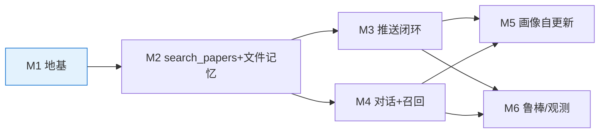

# 文献情报 Agent · 开发路线图

> **文档版本**：v0.4　|　**依赖**：[01_PRD](./01_PRD.md) / [02_architecture](./02_architecture.md) / [03_data_model](./03_data_model.md) / [04_api_design](./04_api_design.md)　|　**状态**：已对齐 2026-05-20 晚第二轮精简评审

> **v0.4 相对 v0.3 的变更**：
> 1. **去重 + 评分工时从 skill 移到 `search_papers` 工具实现**（代码循环，不是 agent for 循环）。
> 2. ❌ **删 M1 的 5 表建表 → 改 3 表**（users/pushes/feedback）；❌ 删"PG `locks` 实现"任务（LangGraph thread_id）。
> 3. **M4 对话历史改"单写派生"**（从 LangGraph state 派生 session md），不再"双写 PG messages"；故障恢复从 LangGraph checkpoint。
> 4. **M4 新增中文召回率 evaluation 任务**。
> 5. **M7 P2 列入 SQLite FTS5 选项**（触发条件：中文召回率 < 85%）。

---

## 0. 原则与节奏

1. **先骨头后肉**：每个里程碑先跑通 end-to-end，再回填实现。
2. **每个里程碑都有 Demo Moment**——是按钮，不是 deck。
3. **行为以 skill 交付**：产出含 `skills/*.skill.md`。
4. **结构化工作落在工具**：去重/评分写进 `search_papers`（代码），不写进 skill 让 agent 循环。

- **总长度**：6 个里程碑 ≈ **9–13 个人天**（约 2.5–3 个业余周，1 人天 = 6h，预留 30% buffer）。

---

## 1. 里程碑总览

| ID | 名称 | 一句话目标 | 产出 SKILL | 人天 | 优先级 |
|----|------|-----------|-----------|------|--------|
| **M1** | 地基与最小链路 | `docker compose up` 后 Streamlit + `/status`（PG / memory_dir / mcp / anthropic 全 ✓） | — | **1d** | P0 |
| **M2** | `search_papers` 工具 + 文件记忆 | 手动触发：搜+去重+评分+落 `./memory/papers/*.md`，`search_memory` grep 得到 | `daily_search`（草稿） | **2d** | P0 |
| **M3** | 每日推送闭环 | 10:00 触发 `lit_agent`：读 skill→生成检索词→调一次 `search_papers`→写邮件+站内 | `daily_search`（完整） | **2.5d** | P0 |
| **M4** | 对话 / 跨日召回 / 派生归档 | `/chat` 流式问答；session md 从 LangGraph state 派生；跨日 grep 召回 | `memory_recall` | **3d** | P0 |
| **M5** | 画像自更新 | agent 读反馈日志按 skill 原子写 `profile.md` | `profile_update` | **1d** | P1 |
| **M6** | 鲁棒 / 可观测 / 备份 | 单源失败不阻塞；告警邮件；PG + memory 备份 | — | **2d** | P1 |
| **M7** | P2 探索（可选） | PDF 全文 / SQLite FTS5 / 推送自评 | skill 扩展 | — | P2 |

**累计 P0+P1 ≈ 11.5 人天**（含 buffer）。

### 1.1 依赖关系（≤ 8 节点）

> M3 / M4 都基于同一个 `lit_agent`，M2 之后逻辑可并行（单人按顺序最稳）。

---

## 2. M1 — 地基与最小链路（1d）

**目标**：`docker compose up -d` 后 Streamlit 显示 "alive ✅"，且真去调 `/status`，4 项检查（PG / memory_dir / paper_search_mcp / anthropic）全 ✓。

| # | 任务 | 预估 |
|---|------|------|
| 1 | `core/config.py` Pydantic Settings 校验必填环境变量 | 1h |
| 2 | `core/logging.py` structlog + `api/middleware.py` RFC7807 | 1.5h |
| 3 | `db/models.py` **3 张表**（users / pushes / feedback）+ 首次 alembic 迁移 | 1.5h |
| 4 | `core/deps.py`（verify_token / get_db / get_memory_dir）+ LangGraph checkpointer 接 PG | 1.5h |
| 5 | `scripts/init_memory.py` 建 `./memory/{papers,sessions,profile,feedback}` + skills 占位 | 0.5h |
| 6 | `api/routes/system.py` `/health` + `/status`（真 ping 4 依赖） | 1.5h |
| 7 | `frontend/app.py` 占位显示 status；端到端 smoke test | 2h |

**验收**：三条启动命令零报错；`/status` 4 项全 ok；无 Token → 401 + RFC7807；`./memory/` 目录就绪；`ruff && mypy` 零报错。

> ❌ 不建 messages/sessions/locks/events 表——对话 state 与并发交给 LangGraph checkpointer（接 PG，框架自建表）。

---

## 3. M2 — `search_papers` 工具 + 文件记忆（2d）

**目标**：`python -m scripts.fetch_once --queries "lithium battery solid electrolyte"` → 工具内部完成"搜（date_desc）+ 去重 + 评分 + 原子写 `./memory/papers/{today}/*.md`"，`search_memory(scope="papers")` 能 grep 到。

| # | 任务 | 预估 |
|---|------|------|
| 1 | `agents/mcp_client.py` 拉起 `paper-search-mcp` 子进程 | 1.5h |
| 2 | `tools/memory.py` 文件工具（search_memory=grep / read_file / write_file=原子写 / list_dir） | 2.5h |
| 3 | **`tools/search_papers.py`**：多 query 调 MCP（`sort_by=date`）→ 合并去重（doi/arxiv_id/normalized_title，对照 `./memory/papers/`）→ Haiku **单次批量评分** → 过滤 min_score → 原子写 Top N | 4h |
| 4 | `Paper` Pydantic schema（工具入参/出参校验闭环）+ paper.md 模板 | 1h |
| 5 | `skills/daily_search.skill.md`（草稿）：读 profile → 生成检索词 → 调一次 `search_papers` | 1h |
| 6 | `scripts/fetch_once.py` + 单测（去重比对 / 路径安全 / grep 命中） | 2.5h |

**产出 SKILL**：`daily_search.skill.md`（草稿）。

**验收**：
- [ ] `fetch_once` 30s 内完成，输出 "`4 sources → 95 raw → 78 deduped → 8 selected`"
- [ ] `./memory/papers/{today}/` 出现 5–10 个 `*.md`（含 score/reason/normalized_title）
- [ ] **去重生效**：同 queries 跑两次，第二次新增 ≈ 0
- [ ] **评分在工具内**：agent 不参与逐篇循环（本里程碑用脚本直调工具验证）
- [ ] 故意拼错 arXiv 源 → 其他三源仍出结果

**关键陷阱**：`paper-search-mcp` 上游变更 → fork 锁版本 + schema 校验；路径穿越 → `write_file` 校验 paper_id `[a-z0-9.-]` 且限定 `./memory/`；摘要控制字符炸 YAML → strip + 安全序列化。

---

## 4. M3 — 每日推送闭环（2.5d）

**目标**：10:00（或 `POST /admin/trigger/daily-push`）APScheduler 用固定 `thread_id=daily_push:YYYY-MM-DD` 叫醒 `lit_agent` → 读 `daily_search.skill.md` → 生成检索词 → **调一次 `search_papers`** → 写邮件 + 站内 `daily-push` 会话，每篇带 👍/👎。

| # | 任务 | 预估 |
|---|------|------|
| 1 | `agents/lit_agent.py` `create_deep_agent()` + `LIT_AGENT_SYSTEM_PROMPT` | 2.5h |
| 2 | `skills/daily_search.skill.md`（完整）：检索词策略 + 调 `search_papers` + 写邮件文案 + 落 push 审计 | 1.5h |
| 3 | `tools/mail.py` `send_email`（Jinja2 + aiosmtplib）+ 邮件模板 | 2.5h |
| 4 | `scheduler/jobs.py` cron(10:00) 注入 system message（固定 thread_id，无 locks 表） | 1.5h |
| 5 | `api/routes/sessions.py`（列表扫 md / 详情读 LangGraph state）+ `api/routes/admin.py` 触发 | 2.5h |
| 6 | `api/routes/feedback.py` POST + 5min 幂等 + 写 PG `feedback` + 追加派生 log | 1.5h |
| 7 | `pushes` 审计写入（queries / 去重计数 / selected_papers / 状态） | 1h |
| 8 | `frontend` 推送会话卡片 + 反馈按钮；端到端集成测试（mock Anthropic + MCP） | 2.5h |

**产出 SKILL**：`daily_search.skill.md`（完整）。

**验收**：
- [ ] `POST /admin/trigger/daily-push` 返回 202，3min 内 `pushes.status=success`
- [ ] 收到真邮件，含 5–10 篇（标题/作者/摘要/理由/链接）
- [ ] 同批推送出现为站内 `daily-push` 会话
- [ ] 点 👍 → PG `feedback` 多一行；5min 内重复 → 409
- [ ] **去重**：连续两天搜到同 DOI，第二天 `search_papers` 不再返回 / 不重复落盘
- [ ] SMTP 密码错 → `pushes.status=partial`，站内推送仍正常
- [ ] 11:00 重试若 10:00 仍在跑 → LangGraph thread busy 自动拒绝（无需 locks 表）
- [ ] prompt caching 生效（`search_papers` 评分第 2+ 次 `cache_read_tokens > 0`）

---

## 5. M4 — 对话、跨日召回与派生归档（3d）

**目标**：Chat 输入"上周那篇硫化物论文用什么表征方法？" → `lit_agent` 判断上下文没有 → 按 `memory_recall.skill.md` 选 scope → `search_memory` grep → `read_file` → 流式回答 + 可点引用。**每轮对话从 LangGraph state 派生追加 session md**（单写），下次跨日可召回。

| # | 任务 | 预估 |
|---|------|------|
| 1 | `api/routes/chat.py` `/chat` SSE（session_id=thread_id，不传则新建）+ meta/tool/citation/token/done + 15s keepalive | 4h |
| 2 | **session md 派生写**：每轮 `done` 后从 LangGraph state 取最近一轮，原子 append 到 session md；同步 frontmatter（last_active_at / message_count / related_papers / topics 每 5 轮） | 3h |
| 3 | `skills/memory_recall.skill.md`：正例/反例表，scope 选择，related_papers 召回路径 | 2h |
| 4 | `frontend/pages/chat.py` `st.chat_message` 流式 + 工具调用可视化 + 引用渲染 | 3h |
| 5 | `api/routes/memory.py` `/memory/papers`（列表/详情含 cited_in）+ `/memory/profile` | 2h |
| 6 | 故障恢复：从 LangGraph checkpoint 重建 session md 的脚本 | 1h |
| 7 | **中文召回率 evaluation**：固定中文问题集测 `search_memory` 在英文库命中率，记录基线 | 2h |
| 8 | 集成测试：跨日召回黄金集（文献 + 对话）≥ 4/5；首 token ≤ 3s 实测 | 3h |

**产出 SKILL**：`memory_recall.skill.md`。

**验收**：
- [ ] 连续 5 轮流式（首 token ≤ 3s）
- [ ] 上下文已有时**零工具调用**（SSE 流无 `tool` 事件）
- [ ] 跨日召回（文献）5 题 ≥ 4/5；跨日召回（对话）优先 `scope="sessions"` 5 题 ≥ 4/5
- [ ] **派生写验证**：每轮后 session md 出现对应 append，frontmatter 同步
- [ ] 删除会话 → LangGraph thread + session md 一起删
- [ ] 故障恢复：删损坏 session md → 从 LangGraph checkpoint 重建一致
- [ ] **中文召回率基线已记录**（< 85% 进 M7 SQLite 评估）

> **召回质量**：靠 paper.md frontmatter（doi/normalized_title/title）+ 正文关键词 + skill 教 agent 用多组同义词搜。不准则优先改 skill / 关键词写入，**不加检索算法**。**延迟红利**：grep < 100ms + read_file < 10ms + Haiku TTFT ~200ms ≈ 首 token < 400ms（无 rerank）。

---

## 6. M5 — 画像自更新（1d）

**目标**：连续 7 天后推送相关性显著提高——`lit_agent` 按 `profile_update.skill.md` 读近期反馈（PG 派生的 `feedback/*.log`）→ **原子写** `profile.md`，不用 LangMem / TF-IDF。

| # | 任务 | 预估 |
|---|------|------|
| 1 | `skills/profile_update.skill.md`：权重表 + 读近 30 天反馈 + 增量改写准则 | 2h |
| 2 | `daily_search.skill.md` 增补：推送前先读 profile.md 注入评分上下文 | 0.5h |
| 3 | profile.md 模板 + `frontend/pages/profile.py`（只读展示） | 2h |
| 4 | A/B 评估脚本：无画像 baseline vs 有画像，对比 Top-10 重合度 / 👍率 | 2h |

**产出 SKILL**：`profile_update.skill.md`。

**验收**：30 条反馈后 `profile.md` 关键词/摘要更新到位（diff 可见）；有/无画像 Top-10 重合 ≤ 60%；第 7 天 👍 率较第 1 天 +20%；用户说"少推液态添加剂"→次日生效。

---

## 7. M6 — 鲁棒性、可观测、备份（2d）

**目标**：从"我能跑"到"睡觉跑也不慌"。

| # | 任务 | 预估 |
|---|------|------|
| 1 | LLM / 抓取 / SMTP 统一 tenacity 退避 + 结构化日志 | 2h |
| 2 | 告警邮件：daily_push 连续失败 3 次 → `[ALERT]` | 1.5h |
| 3 | Backup cron：03:00 `pg_dump`、03:10 `./memory/` tar.gz（可选 git 版本化） | 2h |
| 4 | `search_papers` 子进程健康：MCP 超时 / 崩溃重启 / 版本锁（vendor/） | 2h |
| 5 | session md 灾难恢复脚本完善（从 LangGraph checkpoint 全量重建） | 1.5h |
| 6 | Streamlit `/status` 页：可视化 pushes 审计 + 单源健康 | 2h |
| 7 | README "故障排查 Runbook"；7 天定时烟雾测试（沙箱 limit=5） | 2h |

**验收**：PRD §7 八条全过；删损坏 session md 可重建；连失 3 次收告警；`./backups/` 各有快照；`/status` 可见各步耗时与单源健康。

---

## 8. M7 — P2 探索（可选，不在 MVP 验收范围）

| 候选 | 触发条件 / 价值 | 工时 |
|------|---------------|------|
| **SQLite FTS5 派生索引** | M4 中文召回率 < 85% 才启用；派生自 markdown 可重建，非向量库 | 1d |
| **PDF 全文 RAG** | `download_paper_pdf` + 落 `./memory/papers/*/fulltext.md`，仍走 grep | 2.5d |
| **推送命中率自评** | 每周日 agent 反思上周推送，调评分准则写进 skill | 1d |
| **接入更多 MCP 源**（PubMed / bioRxiv） | — | 0.5d |
| **手机端友好** | — | 1d |

---

## 9. 通用 Definition of Done

- [ ] `ruff check` 与 `mypy` 零报错
- [ ] 相关模块单测 ≥ 60%（`search_papers` 去重/评分 ≥ 80%）；≥ 1 个端到端集成测试
- [ ] 本里程碑 `skills/*.skill.md` 写完并经真实 agent 跑通
- [ ] 改了架构同步更新 `docs/`
- [ ] Demo 能 5 分钟讲清；`docs/retro.md` 记一行实际工时 vs 估算

---

## 10. 风险与缓冲

| 风险 | 里程碑 | 缓解 |
|------|--------|------|
| `paper-search-mcp` 上游变更 / 子进程崩溃 | M2/M3/M6 | fork 锁版本 + schema 校验 + 健康重启 |
| 4 源 API 不稳 | M2 | 任一失败不阻塞 |
| **按相关性排序导致每天 0 篇** | M2/M3 | **强制 `sort_by=date`**（PRD §8） |
| 中文 query 召回率低 | M4 | 记基线，< 85% 进 M7 SQLite |
| agent 误判要不要检索 / 选错 scope | M4 | skill 正例/反例 + SSE `tool` 事件可观测 |
| LLM 月成本超预算 | M3/M4 | dry-run 盯 token，含 cache_read |
| 极窄领域无产出 | 全部 | README 声明不适用（PRD §8） |
| `.env` 误提交 | 全部 | `.gitignore` + pre-commit secret scan |
| DeepAgents / LangGraph API 变更 | 全部 | 基于 LangGraph，必要时降级手写 StateGraph |

---

> **v0.4 已删除 / 改写清单**：❌ M1 的 5 表建表（→3 表）　❌ "PG `locks` 实现"任务（→LangGraph thread_id）　❌ M4 "双写 PG messages"（→单写派生 + checkpoint 重建）　🔧 去重/评分工时从 skill 移入 `search_papers` 工具　➕ M4 中文召回评估、M7 SQLite。
> **下一步**：进入 [CLAUDE.md 项目宪法](../CLAUDE.md)。
